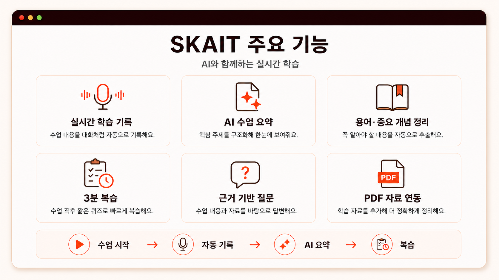
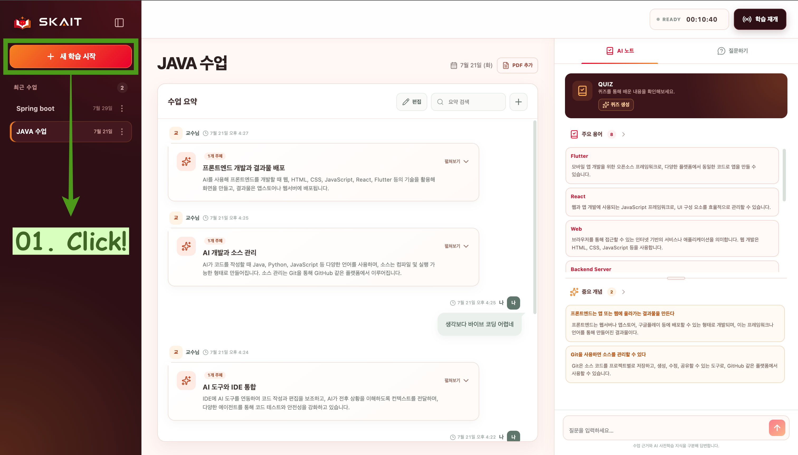
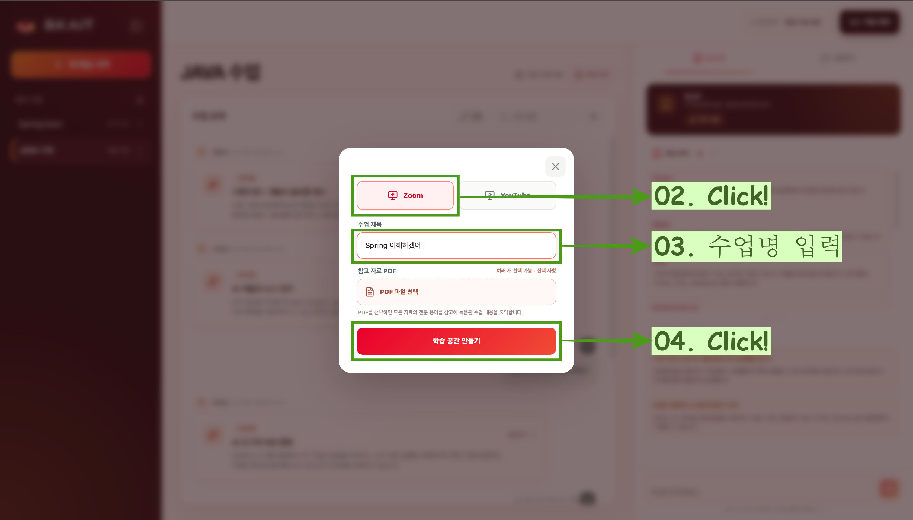
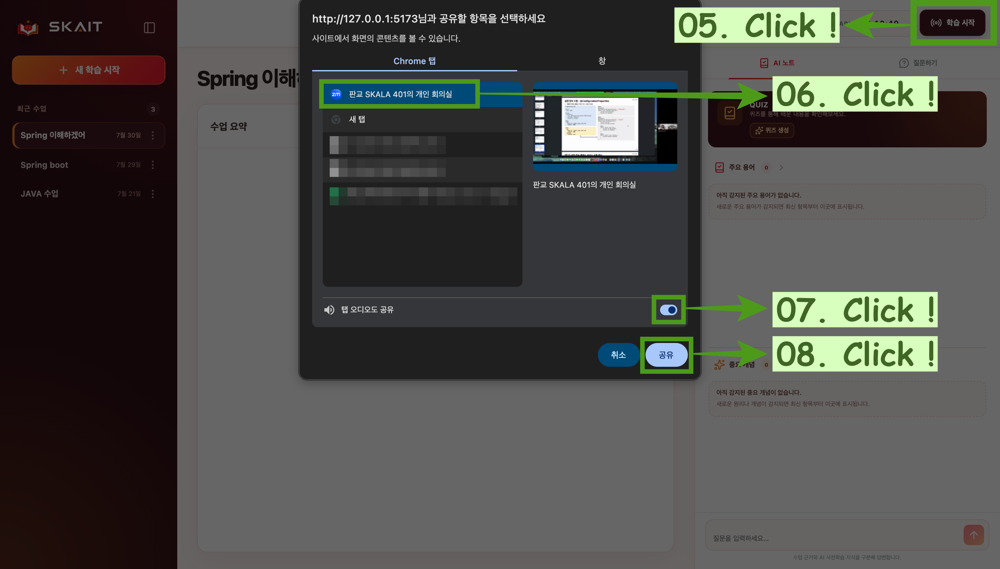

# SKAIT - 로컬 AI 학습 도우미

SKAIT는 **SKALA AI TUTOR**의 줄임말입니다. Zoom·YouTube 수업을 기록하고 AI가 요약, 핵심 개념, 퀴즈와 질문 답변을 제공하는 개인 학습 도우미입니다. AI 처리와 학습 기록 저장은 내 컴퓨터에서 이루어집니다.



> [!IMPORTANT]
> **데스크톱 Google Chrome에서 사용해 주세요. Safari는 지원하지 않습니다.**
>
> 수업을 녹음할 때 Chrome 공유 창에서 수업 탭을 선택하고 `탭 오디오 공유`를 켜야 합니다. Zoom은 데스크톱 앱 대신 Chrome의 Zoom Web을 이용해 주세요.

## 핵심 기능

- Zoom·YouTube 수업 음성 자동 기록 및 AI 요약
- 주요 용어와 중요 개념 정리
- 수업 요약 기반 `QUIZ` 생성·재생성(최대 10문제)
- 수업 근거를 확인할 수 있는 AI 질문 답변
- PDF 참고 자료를 활용한 전문 용어 보정과 요약
- 수업 요약, 직접 추가한 내용과 AI 대화 기록의 로컬 저장

## 설치 및 실행

macOS에서는 [Google Chrome](https://www.google.com/chrome/)과 [Homebrew](https://brew.sh/)를 먼저 설치해 주세요.

```bash
git clone https://github.com/ymj9608/SKAIT.git
cd SKAIT
python3 setting.py
```

최초 설정이 끝나면 아래 명령으로 실행합니다.

```bash
python3 open.py
```


준비가 완료되면 SKAIT가 Chrome에서 자동으로 열립니다. 종료할 때는 터미널에서 `Ctrl+C`를 누르세요. `학습 중지`를 누르지 않았더라도 브라우저가 서버 종료를 감지하면 녹음과 화면 공유를 자동으로 중지합니다.
종료 시 SKAIT가 사용한 Ollama 모델은 즉시 메모리에서 내려가며, 다른 앱과 공유할 수 있는 Ollama 서버만 가벼운 대기 상태로 유지됩니다.
열려 있는 SKAIT 탭이 모두 닫힌 상태가 10초 동안 유지되면 진행 중인 AI 작업을 취소하고 Ollama 모델을 메모리에서 내립니다. FastAPI와 Vite 서버는 유지되며 터미널에서 `Ctrl+C`를 눌러야 완전히 종료됩니다.

로컬 LLM은 기본적으로 Ollama의 `qwen3:4b-q4_K_M`을 사용합니다. 최초 설정에서는 선택 가능한 세 모델을 모두 내려받으므로 약 14.4GB의 저장 공간과 다운로드 시간이 필요합니다. 이미 설치된 모델은 다시 받지 않습니다.
화면 왼쪽 아래의 `설정`에서 Qwen 3 4B(약 2.6GB), Qwen 3 8B(약 5.2GB), Qwen 3.5 9B(약 6.6GB) 중 하나를 선택할 수 있습니다. 선택한 모델 하나를 전사 보정·요약·용어 탐지·퀴즈·질문 답변에 모두 사용합니다. 4B는 기본 모델, 8B는 속도와 품질의 균형, 9B는 품질 우선 선택지입니다. 설치된 모델 파일은 이후 실행에서 재사용합니다.

LLM 실행 옵션은 기존과 동일하게 8K 컨텍스트를 사용하고 응답 후 15분 동안 선택 모델을 메모리에 유지합니다. 요약에서 퀴즈로 기능을 바꿔도 같은 모델을 사용하므로 다시 불러오지 않습니다. 설정에서 모델 자체를 변경하면 기존 모델을 한 번 내리고 새 모델을 다음 AI 작업부터 사용합니다. 설치된 모델 파일과 학습 기록은 삭제하지 않습니다.

## 빠른 사용 및 기능 확인

1. `새 학습 시작`에서 Zoom 또는 YouTube를 선택하고 수업을 만듭니다. PDF 첨부는 선택 사항입니다.

   <p align="center">
     
   </p>

   <p align="center">
     
   </p>

2. `학습 시작`을 누른 뒤 Chrome 공유 창에서 수업 탭과 `탭 오디오 공유`를 선택합니다.

   <p align="center">
     
   </p>

3. 학습이 시작되면 수업 요약, 주요 용어, 중요 개념이 자동으로 정리됩니다.
4. 요약이 표시되면 `퀴즈 생성`으로 문제를 풀거나 `질문하기`에서 수업 내용을 질문합니다.
5. 학습을 끝내거나 중지하고 싶으면 `학습 중지`를 누릅니다. `학습 재개`를 눌러 이어서 학습할 수 있습니다.

## 기록과 업데이트

수업과 대화 기록은 `backend/data/skait.sqlite3`에 저장되며 서버를 다시 실행하거나 코드를 업데이트해도 유지됩니다.

새 버전을 받으려면 프로젝트 폴더에서 실행합니다.

```bash
git pull
python3 setting.py
python3 open.py
```

중요한 기록은 업데이트 전에 `backend/data/skait.sqlite3` 파일을 별도로 복사해 두는 것을 권장합니다.
